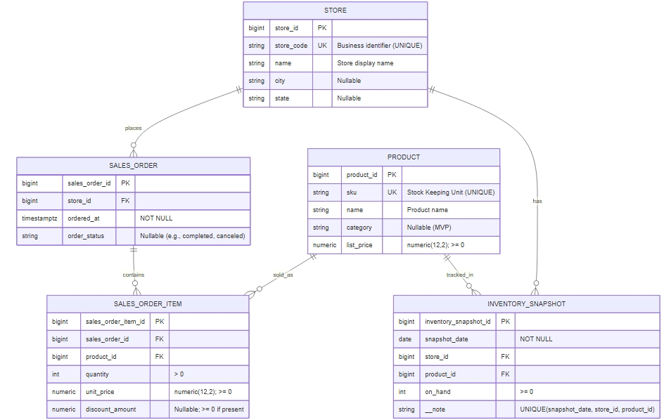

# 🚀 RetailSQL — Relational Data Platform

RetailSQL is a relational data platform designed to model and enforce core retail business processes such as sales transactions, product catalog management, store operations, and inventory tracking.

The project emphasizes normalized schema design, integrity enforcement, and relational correctness — treating the database as a first-class system component rather than an analytical artifact.

**Author:** Kevin Mota da Costa

**Portfolio:** [https://costakevinn.github.io](https://costakevinn.github.io)

**LinkedIn:** [https://linkedin.com/in/costakevinnn](https://linkedin.com/in/costakevinnn)

---

## 🎯 Project Purpose

RetailSQL was built to demonstrate how business logic can be encoded directly at the data layer through strict relational modeling.

The objectives include:

* Designing a normalized relational schema (3NF)
* Enforcing business rules via constraints
* Guaranteeing referential integrity
* Preventing invalid states at storage level
* Providing a reliable foundation for downstream analytics and ML systems

This mirrors production database engineering practices.

---

## 🧠 Core Data Model

RetailSQL models retail operations through a normalized relational schema composed of:

* STORE — physical retail locations
* PRODUCT — product catalog
* SALES_ORDER — transactional sales events
* SALES_ORDER_ITEM — line-level sales details
* INVENTORY_SNAPSHOT — point-in-time inventory state

All relationships are explicitly defined, with no redundant or derived attributes.



---

## 🔒 Business Rules at the Data Layer

Business constraints are enforced directly in the database to prevent invalid states.

Examples include:

* Quantities must be strictly positive
* Monetary values must be non-negative
* A product cannot appear more than once in the same sales order
* Inventory snapshots are unique per (date, store, product)
* All transactional records require valid foreign key references

Enforcement mechanisms:

* PRIMARY KEY
* FOREIGN KEY
* UNIQUE
* CHECK constraints

This ensures data correctness before analytics or modeling ever occur.

---

## 🔗 Relational Integrity

Entity relationships are strictly defined:

SALES_ORDER_ITEM → SALES_ORDER → STORE
SALES_ORDER_ITEM → PRODUCT
INVENTORY_SNAPSHOT → STORE
INVENTORY_SNAPSHOT → PRODUCT

This structure guarantees reliable joins and eliminates ambiguity or duplication during downstream queries.

---

## 📊 Example: Relational Join

Multi-entity join across transactional data:

```
sales_order_id | store_code | sku      | quantity
---------------+------------+----------+----------
1              | S001       | SKU-1001 | 2
1              | S001       | SKU-3001 | 1
2              | S002       | SKU-2001 | 1
```

This demonstrates consistent foreign key enforcement and clean relational structure.

---

## 📦 Example: Inventory Snapshot

Point-in-time inventory state per store and product:

```
snapshot_date | store_id | product_id | on_hand
--------------+----------+------------+---------
2026-01-07    | 1        | 1          | 100
2026-01-07    | 2        | 3          | 100
```

Inventory is modeled as state, not transactional movement, enabling clear analytical interpretation.

---

## 🧪 Verification & Inspection

RetailSQL includes inspection queries to validate:

* Existing tables and schema objects
* Row counts after seeding
* Foreign key relationships
* Constraint definitions
* Index configuration
* Sample data consistency

Full outputs are available in:

```
docs/sample_output.txt
```

---

## 🏗 Physical Structure

```
RetailSQL/
├── erd/
│   ├── retailsql.mmd
│   └── erd.jpeg
├── sql/
│   ├── schema.sql        # Tables and primary keys
│   ├── constraints.sql   # Business rules & integrity
│   ├── indexes.sql       # Physical indexing strategy
│   ├── seed.sql          # Deterministic sample data
│   └── queries.sql       # Inspection & validation
└── docs/
    └── sample_output.txt
```

Each SQL component has a single responsibility, reflecting production database engineering standards.

---

## 🛠 Tech Stack

### Database

PostgreSQL

### Data Engineering

* Relational modeling (3NF)
* Keys and constraints
* Referential integrity enforcement
* Deterministic seeding
* Index design

### Data Quality

* Constraint-based validation
* Schema-level rule enforcement
* Join correctness verification

---

## 🔬 Capabilities Demonstrated

* Translating business requirements into relational schemas
* Designing normalized data models
* Enforcing data quality at storage level
* Preventing invalid states via constraints
* Building foundational data systems suitable for analytics and ML

---

## 🌐 Portfolio

This project is part of my Machine Learning & Data Engineering portfolio:
👉 [https://costakevinn.github.io](https://costakevinn.github.io)

---

## License

MIT License — see `LICENSE` for details.
